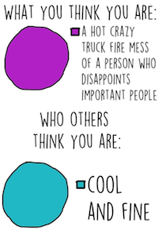

We cannot wait for you to attend Uncommon Hacks February 15-16 at the Polsky
Exchange in Chicago, Illinois. We hope you make friends, learn, meme out, but
most importantly, have fun ᖍ(ツ)ᖌ.

# Before the Hackathon

## What to Bring

Here are some common choices of things to bring to a hackathon.

-   Computer
    -   Or any other hardware you are interested in using
-   Chargers
    -   Phone Charger
    -   Computer Charger
-   Spare clothes
    -   Changing clothes is an awesome feeling if you’re into it
    -   We also recommend bringing a hoodie incase it gets cold
-   Blanket / sleeping bag
    -   We will be providing a room for sleeping, but it might get cold, especially since it’s February :(.
-   Toiletries
    -   We will have toiletries, but we recommend bringing your own toothbrush and paste, face wash if you use it, dry shampoo, tampons, etc.
-   Headphones
    -   Sometimes, you gotta jam out
-   Extra space for swag
    -   You will be getting T-Shirts and other stuff, so come prepared with extra space
-   Warm clothes
    -   It will be cold in Chicago (estimated high of around 25ºF/-5ºC), so if you’re not coming from the area be prepared for cold and wind (and possibly snow)!

## Getting There

See directions.md for directions.

## Additional Comments

If at all possible, try to arrange your schoolwork and schedule so you
won’t have to be worrying about homework over the weekend. You’ll be
able to get the most out of the event, and hopefully will be
re-energized by taking a break from your schoolwork!

A week or so before Uncommon Hacks, you’ll get an invite to our Slack
group. If you haven’t used [Slack](https://slack.com/) before, it’s a
messaging app for teams that we will use to distribute announcements
during the event and facilitate communication. Once you join, you’ll be
able to talk to other hackers to look for teammates or find people to
carpool with. During the event, Slack will be the primary way we make
announcements, and will also be used to connect with mentors and others
for help.

Tenative Schedule
=================

See [uncommonhacks.com](https://uncommonhacks.com) for the
latest info.

**SATURDAY FEBRUARY 16th**

* 9:00 AM – Registration starts
* 10:00 AM – Breakfast
* 10:00 AM - Team Formation I
* 11:00 AM – Interacting with sponsors
* 11:30 AM – Opening ceremony
* 12:00 PM – Hacking starts
* 12:30 PM – Team formation II
* 7:00 PM – Dinner

Be ready for fun suprise mini-events happening throughout the event ;)

**SUNDAY FEBRUARY 17th**

* 12:00 AM – Midnight Snack
* 9:00 AM – Breakfast
* 12:00 PM – Hacking ends
* 1:00 PM – Expo
* 3:00 PM – Closing ceremony
* 3:45 PM – Prizes are awarded
* 4:00 PM – Event ends

# At the Event

## Staying Cool

In a hackathon environment, surrounded by people who hack away,
seemingly intensely focused, it is easy to feel intimidated. If it is
your first time at a hackathon, or your 100th time at a hackathon, you
may feel that everyone around you is more talented than you. That’s not
the environment we want to sustain. Chances are, the person next to you
may have had the same problem you had a week ago! Know that hackathons
are learning experiences for all.

## Safeness

If ever at any point you should feel unsafe at the event, PLEASE come up
to a team member, message us on Slack, or contact the MLH
representative. We will handle the situation accordingly.

## Getting Settled

When you first arrive at the Polsky Exchange, there will be a short
check-in. You’ll receive a n30n wristband to denote yourself as a
hacker, a name tag, a dope t-shirt, a slick sticker, and important
information for the day of the event.

We have a number of sponsors who provide support for this event. When
you’ll arrive, you’ll have a chance to talk with our sponsors about what
they do. Sponsors often come to recruit for jobs and internships, let
you know about their products for developers, and might sponsor a prize
or two.

### Forming a Team

Many people choose to work with teams at hackathons. Some people may
already have a team going into the event: from school, from being meme
friends online, etc. But do not worry if you do not have a team at the
event! We will have a team formation activity at the event for you to
find others to work with who have the same technological interests or
same meme interests as you.

More importantly, have no fear if you think you’re not good enough to
work on a team. There is always something for everyone to do on a
hackathon team, whether it be design, the front-end work, the back-end
work, connecting the circuits for the hardware device. Just make it
known that you are willing to work and to learn, and you should be
great.

It’s also totally fine to work on a project by yourself.

### Deciding on an idea

When you have a team, start thinking about what you might want to build.
You can build basically anything you want, with the main rule being you
have to build it entirely during Uncommon Hacks. We’ll have a number of
themed prizes, such as “Most Uncommon” (see the Devpost site for the
full list), which you might use as inspiration for your project. You
also can look at [last year's
submissions](https://uncommonhacks2018.devpost.com/submissions) for
some examples of what kinds of projects people have worked on.

It can be hard to decide on an idea, especially if you’re working with
teammates you’ve just met. Have fun brainstorming, and you can approach
finding an idea from either the perspective of what you are interested
in, or what technologies you are interested in learning.

Don’t feel like your project has to be the next big thing or something
you’d use every day. **We encourage you to make something creative and
fun and possibly totally useless!** What *is* important is that you have
a good time building it and learn in the process.

## Opening Ceremonies

Once you’ve had some time to get settled, we’ll officially start the
event with the opening ceremonies. Some of our sponsors will give a short
presentation about what they do. You’ll also hear from our partner
[Major League Hacking](http://mlh.io), which helps organize over 200
student hackathons each year and provides organizational support. We’ll
also go over the basic rules for the event, and provide an overview of the next 24 hours!

## Working on your Project

After opening ceremonies, it’ll be time to jump in and get working!
You’ll have 24 hours to make your project.

### Starting your Project

Once you’ve settled on an idea and are ready to dive in, one the first
barriers you might run into is setting up your environment and doing all
the
[yak-shaving](http://www.hanselman.com/blog/YakShavingDefinedIllGetThatDoneAsSoonAsIShaveThisYak.aspx)
necessary to start writing code. This can seem difficult, and it can be
tricky to get everyone on your team on the same page, but it’s important
to do these first steps. Check out the Additional Resources section for
some getting started guides for different environments.

When you have a free moment, it’s also wise to draft your submission to
Devpost, which is the site
we use to track submissions. Everyone on your team should make an
account, and you can add multiple people to a project. Most other
hackathons also use Devpost for submissions, so you’ll be able to build
a portfolio with the projects you make!

### Asking for Help

There’ll be a point where you get stuck on something when working on
your project, whether it be a technical roadblock, a decision you don’t
have enough information to make, or a question about best practices. We
will have a few mentors during the event who will be around to answer
any technical questions, and there are also are probably other hackers
who might be familiar with what you are working with. Just send a
message to the *technical\_help* channel on Slack, and someone should
get back to you!

If you have a question about the event for the Uncommon Hacks team (such
as a scheduling questions, rule clarifications, etc.), send a message to
the *questions* channel. There’s a good chance someone else has the same
question, and this lets anyone on our team respond. You can also message
any of the team members directly on Slack if necessary.

## Additional Events

At Uncommon Hacks, we’ll have numerous fun events, such as workshops
done by students, Soylent Pong, SOLO cup stacking, and much more. These
workshops are meant to be fun learning experiences that serve as a break
from your project. And yes, Soylent Pong is what it sounds like - [beer
pong](https://www.bpong.com/beer-pong-rules/), a common college
drinking game, but with [Soylent](https://www.soylent.com/), the meal
replacement drink. We will also have water available.

We want the other events to be a surprise… so you will not find out
until the day of ;).

## Food

We’ll be providing all meals and snacks throughout the event, so don’t
worry about bringing food (unless you love very specific snacks). If you
have dietary restrictions, all the food should be clearly labelled and
there should be options for everyone. If something isn’t labelled or you
have any other questions, please let us know.

## Sleeping

Hackathons have a reputation for uninterrupted work with little sleep,
but it’s important that you have energy for the entire event and don’t
burn out. You *should* take some time to get a decent night’s sleep.

At Uncommon Hacks, we’ll have a large room for
sleeping. We’ll also have earplugs (highly recommended), and would
recommend you bring a sleeping bag and/or blanket.

## Finishing your Project

When you’re almost done with your project, make sure to finalize your
submission on Devpost and click submit before the deadline (12pm on
Sunday)! Devpost will be the way we look and submit projects, so it is key that you register for a team otherwise your project will not be judged. You can select which of the theme and sponsor prizes you want
your project to be reviewed for.

When time is up, you must stop hacking. However, you’re allowed to debug
and make small fixes to their programs if necessary, e.g. if during
demoing your hack you find a bug that breaks your application and the
fix is only a few lines of code, it's fine to fix that.

## Demos and Presentations

### The Expo

After hacking has ended and a short break for lunch, the main room will
be set up for demos in a science-fair style expo. We’ll use the Devpost
submissions to assign each group to a table, and announce the table
assignments when they are determined. Your group will be given a table
number, and there will be some time for judges and other participants to
walk around and see your projects. Even if your project isn’t fully
working or you didn’t finish it, you should still present! People like
hearing about what you tried to do, what challenges you faced, what
technology you used, and what you learned.

We will have a number of judges who will be going around and asking
about your projects. They will be using a judging system called
[Gavel](http://www.anishathalye.com/2016/09/19/gavel-an-expo-judging-system/)
(which was built by the HackMIT team) on their phones to rank the
projects. Using fancy math, Gravel aggregates all the judges’ responses
and determines a ranking, which is used to determine the top projects.
Themed prizes will be judged separately, and sponsor prizes will be
judged by the sponsors, respectively.

### Final Presentations and Awards

After the expo, we'll have some of the top projects present, and then will give out awards. After some closing remarks, the event will finish!

# Additional Resources

## About Hackathons

- [Hackathons are for
beginners](https://medium.com/tfogo/hackathons-are-for-beginners-77a9c9c0e000)
- [MLH’s General FAQ](http://mlh.io/faq)
- [4 Things You Should Do To Prepare for A
Hackathon](http://blog.onemonthrails.com/4-things-you-can-do-to-prepare-for-your-first-hackathon/)
- [Hackathons aren’t about the
hacks](https://medium.com/hackathon-hackers/hackathons-arent-about-the-hacks-a2d84bf60a47)
- [Hackathon
Necessities](https://www.sparkpost.com/blog/hackathon-necessities/)
- [Even more resources](https://github.com/xasos/Hackathon-Resources)

## Technical Resources

Once you have an idea for a project, you’re going to figure out how to build it. Of course, Google is one of the best ways to figure out how to build your project. For example, if you would like to build a website, you can google “How to Build a Website” or “HTML/CSS/Javascript.” Some great tutorials for beginning new topics are [CodeAcademy](https://www.codecademy.com/), [Tutorials Point](https://www.tutorialspoint.com/tutorialslibrary.htm) if you know exactly what language you’re using, or [Treehouse](https://teamtreehouse.com/) if you like learning with videos. [MDN](https://developer.mozilla.org/en-US/) is a fantastic resource for web development and browser extensions. There are also many MOOC’s (Massive Online Open Courses) online. Once you know what stack you will be using, you can dive in by researching tutorials online for what you’re building online. Ensure that you are dividing up the work evenly within your team. Our advice is to take it step by step - write one piece of code, see if it works, then build on the next part. Debugging is annoying, so tread carefully!

# About This Guide

Written by Ben Weinshel and Juliette Hainline, Uncommon Hacks

This is a living document. Please email
[celery@uncommonhacks.com](mailto:celery@uncommonhacks.com) with any
comments or suggestions, or file an issue or pull request on this
repository. If you’re organizing a hackathon, feel free to fork this
repository and adapt this document for your needs!

 This work is licensed under a <a rel="license" href="http://creativecommons.org/licenses/by/4.0/">Creative Commons Attribution 4.0 International License</a>.
